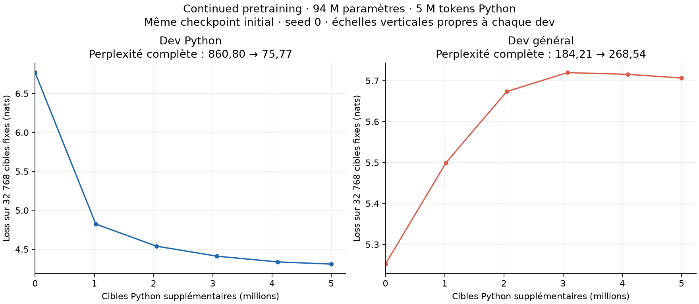

# Continued pretraining : adaptation Python et perte hors domaine

Essai terminé le **25 septembre 2026**. Après 5 M de tokens Python
supplémentaires, le modèle 94 M prédit nettement mieux le dev Python, mais
se dégrade sur le dev général. **Les générations restent répétitives et ne
réalisent pas les deux fonctions demandées.** Cette adaptation n’est donc pas
une amélioration générale du modèle.

| Dev complet | Cibles évaluées | Loss avant | Loss après | Perplexité avant | Perplexité après | Variation de perplexité |
| --- | ---: | ---: | ---: | ---: | ---: | ---: |
| Python | 249 999 | 6,757865 | 4,327726 | 860,80 | **75,77** | **−91,20 %** |
| Général | 999 999 | 5,216053 | 5,592984 | 184,21 | **268,54** | **+45,78 %** |

Chaque comparaison avant/après utilise exactement le même fichier dev.
La différence de difficulté entre les deux corpus interdit d’interpréter
directement « 75,77 contre 268,54 » comme une comparaison de capacités.
Le score général initial reproduit exactement la
[référence 94 M / 50 M tokens](pretraining-50m.md).



Les courbes représentent les mêmes 32 768 cibles fixes par corpus, évaluées
avant adaptation, toutes les 500 mises à jour et à la fin. Les scores en titre
et dans le tableau portent sur les devs complets ; les deux axes verticaux
ont leur propre échelle. Le gain Python ralentit au fil de l’adaptation.
La dégradation générale apparaît dès la première évaluation intermédiaire.

## Protocole et coût

Le [protocole](../experiments/continued_pretraining_python.md) et la
[configuration](../experiments/continued_pretraining_python_config.json)
fixent une seule passe sur les [5 M de tokens préparés](continued-python-5m-data.md).
Le modèle conserve ses 94 124 928 paramètres, RoPE/GQA/SDPA, contexte 256,
batch 8 et entraînement BF16 avec évaluation FP32. Les poids proviennent du
checkpoint général, puis AdamW et son calendrier repartent de zéro : pic
`1e-4`, warmup 50 mises à jour, décroissance cosinus jusqu’à `1e-5`.

- **4 999 999 cibles** traitées en **2 443 mises à jour** ;
- boucle d’entraînement : **5,41 minutes**, hors évaluations et sauvegardes ;
- durée interne du runner : **7,64 minutes** ; chronomètre du processus : **7,93 minutes** ;
- intervalle entre horodatages UTC du lanceur : **8,67 minutes** ;
- débit de la boucle : **15 392 cibles/s** ; pic CUDA alloué : **4,25 Gio**.

La machine est la RTX 4060 Laptop GPU 8 Gio, avec PyTorch `2.10.0+cu128` et
Python `3.11.14`. Les différents chronomètres sont archivés séparément ; la
durée de la boucle ne doit pas être présentée comme le temps total de l’essai.

## Générations et interprétation

Les cinq prompts sont générés avant/après en greedy, au plus 64 nouveaux tokens.
Les trois générations générales avant adaptation reproduisent exactement
celles de la référence. Après adaptation, le vocabulaire et la forme du code
envahissent aussi les prompts généraux : « The purpose of science is » dérive
vers des imports `from __future__` répétés. Les répétitions persistent.

Sur `def add(a, b):`, le modèle adapté produit des commentaires répétés sur
un fichier introuvable, sans addition. Sur `def factorial(n):`, il répète
un commentaire `0x00 -> 0x00`. La forte baisse de perplexité mesure donc un
meilleur ajustement statistique au corpus Python ; ces sondes ne montrent pas
une capacité fonctionnelle à programmer. Les sorties intégrales avant/après
sont conservées dans les [mesures JSON](continued-python-5m.json).

Cet essai illustre le compromis spécialisation/rétention : amélioration dans
le domaine adapté et oubli mesurable hors domaine. Il ne sépare pas les effets
du corpus, du taux d’apprentissage et du budget, et ne porte que sur une seed.
Les limites de séparation par dépôt, de quasi-doublons et de représentativité
du corpus sont documentées dans l’audit des données. Aucun des deux holdouts
n’a été évalué ; le point final est fixé par le budget, sans sélection du
meilleur checkpoint sur les devs.

La partie **continued pretraining du jalon 6 est mesurée**. La référence
généraliste reste le checkpoint avant adaptation. Le SFT reste à pratiquer
pour étudier l’apprentissage sur des couples instruction/réponse ; cette
expérience ne permet pas de promettre qu’il corrigera le manque de capacités.

## Vérifications et artefacts

Les **176 tests du laboratoire passent** avec `python -m pytest tests -q`.
Les nouveaux tests vérifient notamment l’optimiseur neuf, les poids initiaux,
la reprise exacte, l’exclusion du dev général des mises à jour et les règles
du corpus Python. L’audit final confirme le nombre de cibles, les identités
des données, les offsets dev généraux, le checkpoint source inchangé et un
**écart maximal de logits nul** après rechargement du modèle final.

- Code d’entraînement : commit `d945dbc5c1f742c43dc75ee349a47645e5e7ee74`.
- Exécution et hashes : [provenance archivée](continued-python-5m-execution.json).
- Run local : `runs/simple-baseline-mxq_ot5k/` ; lanceur : `runs/continued-python-5m-launch-su7jtw_3/`.
- Checkpoint adapté : `runs/simple-baseline-mxq_ot5k/model.pt`, conservé localement.
- Checkpoint de départ : `runs/simple-baseline-2fsdgx0q/model.pt`, conservé intact.
- [Mesures](continued-python-5m.json), [manifeste](continued-python-5m-manifest.json), [courbes SVG](continued-python-5m.svg).

Reproduire le graphique :

```sh
python -m evaluation.plot_continued_pretraining results/continued-python-5m.json \
  --output-prefix results/continued-python-5m
```
