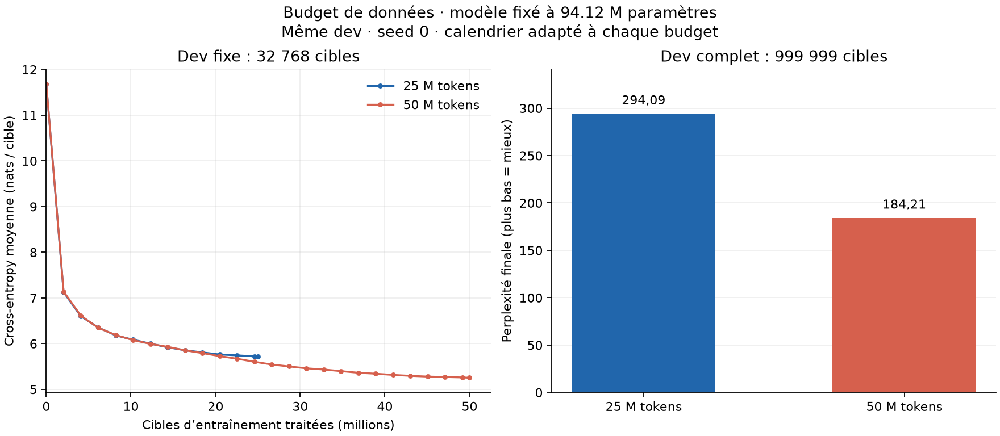

# Scaling des données : 25 M contre 50 M

**Comparaison terminée le 24 septembre 2026.** Le run 25 M s’est achevé sans
erreur à 16 h 27 (Paris). Sur exactement le même dev complet, la perplexité
passe de **294,09 à 25 M tokens** à **184,21 à 50 M**, soit **−37,36 %**.
La loss diminue de **0,467844 nat par cible**. Les générations restent répétitives
dans les deux cas.

[Protocole](../experiments/data_scaling.md),
[configuration 25 M](../experiments/pretraining_25m_config.json),
[audit du sous-ensemble](pretraining-25m-data.md),
[métriques et générations 25 M](pretraining-25m.json),
[résultats 50 M](pretraining-50m.md).

| Mesure | 25 M | 50 M |
| --- | ---: | ---: |
| Paramètres | 94 124 928 | 94 124 928 |
| Cibles d’entraînement traitées | 24 999 999 | 49 999 999 |
| Mises à jour réalisées | 12 208 | 24 415 |
| Loss finale, dev complet | 5,683896 | 5,216053 |
| Perplexité finale, dev complet | 294,093072 | 184,205643 |
| Boucle d’entraînement, minutes | 26,48 | 57,60 |
| Chronomètre interne du runner, minutes | 28,88 | 60,67 |
| Durée entre horodatages du lanceur, minutes | 31,74 | 66,41 |
| Débit soutenu, cibles/s | 15 736 | 14 467 |
| Pic mémoire alloué, octets | 4 566 484 480 | 4 566 484 480 |



À gauche, les deux modèles sont évalués sur les **mêmes 32 768 cibles dev** à
chaque point. À droite, les résultats finaux portent sur **999 999 cibles** du
dev complet. Les valeurs finales sur l’échantillon sont 304,01 et 190,96 ; elles
ne doivent pas être confondues avec les perplexités du dev complet.
Les échantillons train diffèrent et ne figurent pas dans cette comparaison.

Reproduire la figure depuis la racine du dépôt :

```sh
python -m evaluation.plot_data_scaling results/pretraining-25m.json \
  results/pretraining-50m.json --output-prefix results/data-scaling-25m-50m-curves
```

## Conditions de comparaison

Les deux runs partent de poids aléatoires avec seed 0. Le modèle, les modules
d’entraînement, le tokenizer et la recette d’optimisation sont communs. Le
warmup et le cosinus suivent la durée de chaque budget : warmup 125/250 mises
à jour, puis décroissance vers le même plancher au dernier pas. Les fenêtres
train sont recalculées sur les fichiers respectifs.

Le sous-ensemble 25 M contient 6,25 M de tokens par domaine. Le dev est
**strictement identique** à celui de la référence 50 M, avec 999 999 cibles
pour l’évaluation complète. Le holdout est aussi conservé à l’identique et
reste réservé, sans score de modèle. Les 162 tests et l’audit ont passé avant
le lancement du run 25 M.

Le contrôle au démarrage retrouve **exactement les mêmes métriques dev
initiales** que la référence 50 M, sur le dev complet (loss 11,687100346301015)
et sur l’échantillon fixe. L’échantillon train diffère, conformément au changement
de fichier train.

## Interprétation et générations

Dans cette expérience, doubler le budget de données avec le calcul associé
améliore nettement la validation. La boucle d’entraînement coûte **2,18 fois**
plus de temps ; le débit soutenu varie entre les deux exécutions sur le même
portable. Les durées internes et celles des horodatages civils restent distinctes :
les journaux ne permettent pas d’attribuer précisément leurs écarts.

La comparaison porte sur deux budgets complets, chacun avec son calendrier
d’apprentissage, et une seule seed. Elle n’isole pas la diversité des données
du nombre de mises à jour et ne suffit pas à ajuster une loi de scaling ni à
garantir le même gain au prochain doublement.

Les trois prompts, le décodage greedy et la limite de 64 nouveaux tokens sont
identiques. À 25 M, le texte sur la science boucle autour de « study », celui
sur l’histoire autour de « American », et le prompt Python autour de « type »
puis de flèches. À 50 M, les répétitions persistent et le code Python reste
incorrect. La meilleure perplexité ne suffit donc pas à produire des réponses
utilisables sur ces exemples. Toutes les sorties sont conservées dans les JSON.

## Vérifications et artefacts

- Le run 25 M se termine par `complete`, avec un code de sortie 0 et le budget
  exact, y compris la dernière fenêtre partielle.
- Le checkpoint final rechargé produit des logits identiques : écart maximal 0.
- Les fichiers train/dev et le manifeste sont inchangés depuis le lancement.
- Les hashes dev, les offsets d’évaluation, le tokenizer et les configurations
  ont été comparés à la référence 50 M ; seules les différences prévues sont présentes.
- Les métriques 25 M sont archivées à l’identique. Les sources exécutées et la
  configuration correspondent au snapshot du lanceur.

Le code du lancement est celui du commit
`fb5f98080e17df4217cea964104fc7958d35c243`, publié sur `main`. Les 28 sources
Python communes au snapshot 50 M sont inchangées. Le lanceur conserve les
sources exécutées, leurs SHA-256, la commande, le manifeste et une copie exacte
des métriques de référence : `runs/pretraining-25m-launch-ar5qxr1r/`.
Le run est conservé dans `runs/simple-baseline-korcrdq1/`, avec `model.pt`,
`recovery.pt`, `metrics.json`, `config.json` et `progress.jsonl`. Les checkpoints
et journaux complets restent locaux, ignorés par Git.
