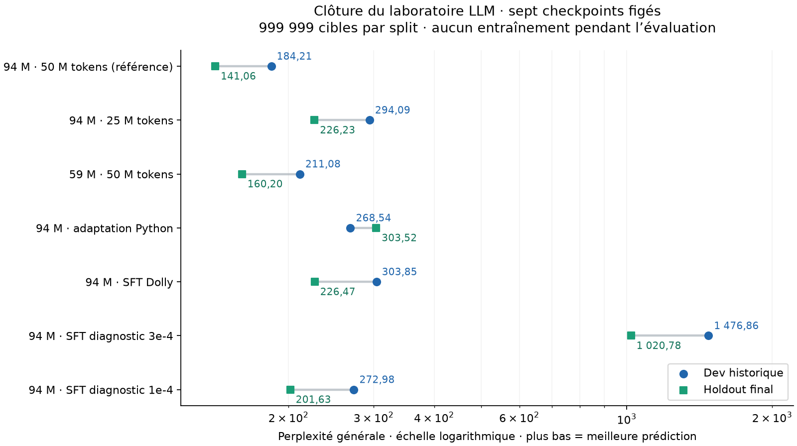

# Évaluation finale sur les holdouts

Évaluation terminée le **1er octobre 2026**, selon le
[protocole figé avant ouverture](../experiments/final_holdout.md).
Sept checkpoints, trois jeux réservés et onze couples modèle/jeu ont été
mesurés, avec **zéro mise à jour des poids**. Aucun résultat n’a servi
à ajuster les modèles ou à choisir un nouveau checkpoint.

Les effets observés sur dev se retrouvent dans les comparaisons finales :
davantage de données et de paramètres améliorent la prédiction générale ;
l’adaptation améliore son domaine avec une dégradation hors domaine ;
un taux SFT réduit limite cette dégradation. Les capacités de génération
restent insuffisantes pour présenter le modèle comme un assistant fiable.

## Texte général : mêmes 999 999 cibles pour les sept modèles

| Checkpoint figé | Perplexité dev historique | Perplexité holdout |
| --- | ---: | ---: |
| 94 M / 50 M tokens, référence | 184,21 | **141,06** |
| 94 M / 25 M tokens | 294,09 | **226,23** |
| 59 M / 50 M tokens | 211,08 | **160,20** |
| 94 M après adaptation Python | 268,54 | **303,52** |
| 94 M après SFT Dolly | 303,85 | **226,47** |
| 94 M après SFT diagnostic, pic `3e-4` | 1 476,86 | **1 020,78** |
| 94 M après SFT diagnostic, pic `1e-4` | 272,98 | **201,63** |



Chaque colonne correspond à un split distinct. La différence entre les deux
colonnes ne mesure pas un gain d’entraînement : les poids sont identiques,
mais les textes diffèrent. On compare les modèles **à l’intérieur d’une même
colonne**. La figure utilise une échelle logarithmique.

Sur le holdout général :

- passer de 25 M à 50 M tokens avec le modèle 94 M réduit la perplexité de **37,65 %** ;
- passer de 59 M à 94 M paramètres à 50 M tokens la réduit de **11,95 %** ;
- diviser le taux SFT diagnostic par trois réduit la perplexité générale
  de **1 020,78 à 201,63**, mais celle-ci reste supérieure aux **141,06**
  du checkpoint généraliste.

Le checkpoint généraliste avait été retenu avant ces mesures. Les deux
modèles du diagnostic SFT n’ont pas de holdout distinct de consignes ;
leur score ici porte exclusivement sur les textes généraux. Leur échec
de transfert reste documenté dans le [diagnostic de développement](sft-transfer-v1.md).

## Adaptation Python

| Holdout | Cibles | Généraliste avant adaptation | Après 5 M tokens Python |
| --- | ---: | ---: | ---: |
| Python | 249 999 | 950,89 | **64,80** |
| Général | 999 999 | 141,06 | **303,52** |

La perplexité Python diminue de **93,19 %**, tandis que la perplexité générale
augmente de **115,16 %**. La spécialisation statistique est nette.
Cette mesure de prédiction de tokens ne prouve pas la correction de programmes ;
aucun nouveau benchmark d’exécution de code n’a été ajouté à la clôture.

Les deux holdouts sont comparés séparément. Les niveaux de perplexité Python
et générale n’ont pas la même difficulté ni la même distribution.

## SFT Dolly

La loss de réponse porte sur **les 300 exemples holdout**, soit **7 699 cibles
réponse/EOS**. La génération porte sur un échantillon fixé de **24 exemples**,
six par catégorie, identique pour les deux modèles.

| Mesure holdout Dolly | Généraliste avant SFT | Après SFT Dolly |
| --- | ---: | ---: |
| Loss de réponse complète | 6,066371 | **5,146494** |
| Perplexité de réponse | 431,11 | **171,83** |
| Accuracy par token avec tokens précédents de référence | 24,04 % | **34,23 %** |
| Réponses exactes en génération libre | 0/24 | **0/24** |
| F1 lexical moyen | 0,0671 | **0,1313** |
| Arrêt à EOS | 0/24 | **19/24** |
| Fraction moyenne de 4-grammes répétés | 65,23 % | **19,32 %** |

Le SFT améliore les probabilités des réponses attendues, leur format et
la répétition, sans obtenir de réponse exactement correcte sur l’échantillon.
Les quatre catégories restent chacune à **0/6**. Le score exact ne reconnaît
pas toutes les paraphrases acceptables ; le F1 ne mesure pas directement
la correction sémantique. Ce petit échantillon ne quantifie pas toutes les
capacités du modèle.

La perplexité générale après SFT augmente de **60,54 %**, de 141,06 à 226,47.
L’amélioration de la loss spécialisée ne suffit donc pas à conclure à une
amélioration globale.

## Intégrité de la mesure

Les **225 tests passent**, en 34,61 s, avec 20 avertissements de dépréciation
issus des dépendances. Les nouveaux contrôles testent les mauvais hashes,
les fichiers de mauvais split, les alias, les fuites train/dev, les tokens
invalides, les comptes de cibles et les fenêtres finales incomplètes.

Avant de lire les holdouts, les sept checkpoints ont reproduit
**exactement** leurs scores sur les 32 768 cibles de contrôle du dev général.
La tolérance prévue de `1e-6` sur la loss n’a pas été nécessaire.

L’audit final vérifie les onze mesures, la couverture des cibles, les
48 générations Dolly locales, ainsi que les empreintes inchangées des
poids, du code, du protocole et des données. Aucune séquence externe ou
génération Dolly détaillée n’est publiée : les scores, IDs et empreintes
suffisent à examiner les résultats.

Le chronomètre interne mesure **310,82 secondes**, soit environ **5 min 11 s**,
contrôles dev inclus ; les horodatages UTC couvrent 337,20 s.
Le pic CUDA alloué mesuré reste à **1,89 Gio** au maximum. GPU RTX 4060 Laptop,
PyTorch `2.10.0+cu128`, FP32, batch 8, contexte 256, un modèle à la fois.
Ces durées décrivent cette exécution ; elles ne constituent pas un benchmark
comparatif de performance.

## Portée et statut des jeux réservés

Les résultats portent sur une seule seed, de petits corpus et les splits
déjà préparés. Les corpus sont des préfixes filtrés, avec déduplication
exacte et des limites de séparation documentées. Ils ne représentent pas
tout Dolma, tout Python ou toutes les consignes possibles.

Les anciens essais NoPE/RoPE/GQA/BF16 sur un autre corpus restent dans leur
cadre d’évaluation historique : leur absence de chevauchement avec ce
holdout récent n’est pas garantie, et ils n’y ont pas été évalués.

**Les trois holdouts ont maintenant été utilisés pour l’évaluation finale
de ce cycle.** Ils peuvent servir à reproduire les mesures, mais ne seront
plus des jeux inconnus pour une future optimisation informée par ce bilan.
Le parcours est clôturé sans entraînement supplémentaire.

- Code exécuté : `09589cc`, protocole et identités commités avant les mesures.
- [Configuration figée](../experiments/final_holdout_config.json), [runner](../evaluation/final_holdout.py).
- [Métriques](final-holdout-v1.json), [exécution et empreintes](final-holdout-v1-execution.json), [comparaisons et audit](final-holdout-v1-analysis.json), [figure SVG](final-holdout-v1.svg).
- Run local : `runs/final-holdout-_cxo5wnq/`.
- [Bilan des sept jalons](bilan-final.md).

Reproduire la figure :

```sh
python -m evaluation.plot_final_holdout results/final-holdout-v1.json \
  --output-prefix results/final-holdout-v1
```
