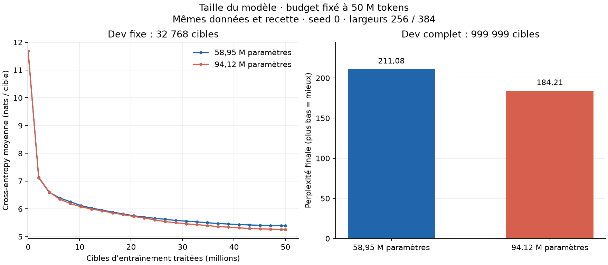

# Scaling de la taille : 59 M contre 94 M de paramètres

**Comparaison terminée le 25 septembre 2026.** Le run 59 M s’est achevé sans
erreur à 14 h 39 (Paris). Sur les mêmes 50 M de tokens train et le même dev,
le modèle 59 M atteint une perplexité de **211,08**, contre **184,21** pour 94 M.
Il économise **25,40 % du temps de boucle** et **13,56 % du pic mémoire alloué**,
avec une perplexité **14,59 % plus élevée**. Les générations restent répétitives.

[Protocole](../experiments/model_scaling.md),
[configuration 59 M](../experiments/pretraining_59m_params_50m_tokens_config.json),
[métriques et générations 59 M](pretraining-59m-params-50m-tokens.json),
[référence 94 M](pretraining-50m.md),
[benchmark préalable](model-size-benchmark.md).

| Mesure | Modèle 59 M | Modèle 94 M |
| --- | ---: | ---: |
| Paramètres | 58 948 864 | 94 124 928 |
| Largeur / MLP | 256 / 1 024 | 384 / 1 536 |
| Cibles d’entraînement traitées | 49 999 999 | 49 999 999 |
| Mises à jour réalisées | 24 415 | 24 415 |
| Loss finale, dev complet | 5,352226 | 5,216053 |
| Perplexité finale, dev complet | 211,077711 | 184,205643 |
| Boucle d’entraînement, minutes | 42,97 | 57,60 |
| Chronomètre interne du runner, minutes | 45,37 | 60,67 |
| Durée entre horodatages du lanceur, minutes | 49,82 | 66,41 |
| Débit soutenu, cibles/s | 19 394 | 14 467 |
| Pic mémoire alloué, octets | 3 947 200 000 | 4 566 484 480 |



À gauche, les courbes évaluent les mêmes **32 768 cibles dev** à chaque point.
À droite, les perplexités finales portent sur les **999 999 cibles** du dev
complet. Les perplexités finales sur l’échantillon sont 219,11 et 190,96 ; elles
diffèrent donc des résultats sur le dev complet.

Reproduire la figure depuis la racine du dépôt :

```sh
python -m evaluation.plot_model_scaling results/pretraining-59m-params-50m-tokens.json \
  results/pretraining-50m.json --output-prefix results/model-scaling-59m-94m-curves
```

## Conditions de comparaison

Le fichier train, le dev, les fenêtres et leur ordre sont identiques. Les hashes
du manifeste et des fichiers ainsi que les offsets d’évaluation ont été comparés
à la référence avant lancement et après achèvement. Le holdout reste réservé
et n’a pas été évalué.

La configuration ne change que le nom, la largeur du modèle et celle du MLP.
Les huit blocs, RoPE, GQA 8Q/2KV, BF16/SDPA, le tokenizer, le contexte, le batch,
la seed et l’optimiseur sont conservés. Le budget de tokens identique permet de
garder aussi exactement le même warmup et le même calendrier cosinus. Les poids
sont initialisés aléatoirement pour la nouvelle taille ; aucune reprise des
poids du modèle 94 M n’est utilisée.

La loss dev initiale du modèle 59 M était de 11,671055, contre 11,687100 pour
94 M. Une même seed ne produit pas des poids ou des scores initiaux identiques
pour deux architectures de dimensions différentes.

## Coût et interprétation

La réduction de largeur retire **37,37 % des paramètres**. À nombre de tokens
et de mises à jour identique, le modèle réduit économise 14,63 minutes de boucle,
mais sa loss dev finale est supérieure de **0,136174 nat par cible**. La référence
94 M obtient donc une meilleure validation dans cette recette ; le 59 M offre
un coût d’exécution inférieur. Ce résultat ne détermine pas un meilleur modèle
indépendamment du budget et de l’usage.

Le run 59 M a pris 49,82 minutes entre les horodatages du lanceur, dans la
fourchette annoncée de 45 à 55 minutes. Le chronomètre interne du runner indique
45,37 minutes, dont 42,97 pour la boucle. Ces durées sont conservées séparément :
les journaux ne permettent pas d’attribuer précisément l’écart entre les deux
horloges. Le débit soutenu de 19 394 cibles/s est proche du benchmark court
à 19 327 cibles/s ; la référence 94 M avait un débit soutenu plus faible que son
propre benchmark court. Les essais ont eu lieu sur le même portable à des moments
différents, ce qui limite l’attribution exacte des écarts de temps à l’architecture.

Les trois prompts sont décodés en greedy, jusqu’à 64 nouveaux tokens, sans tri
des sorties. À 59 M, la science boucle autour de « University of California »,
l’histoire répète « history of the world » et le prompt Python répète une
instruction sur l’option `@`. Les sorties 94 M étaient aussi répétitives et le
code incorrect. Aucun des deux modèles n’est devenu utilisable sur ces exemples.
Les sorties intégrales sont conservées dans les JSON.

Une seule seed et une recette partagée entre deux tailles donnent une première
mesure à budget de tokens fixé. Les hyperparamètres n’ont pas été optimisés
séparément pour chaque taille ; il ne s’agit pas d’une comparaison à compute
égal ni d’une conclusion générale sur la taille optimale.

## Vérifications et artefacts

- Le journal se termine par `complete` et le processus sort avec le code 0.
- Le budget exact est couvert, y compris la dernière fenêtre partielle.
- Le checkpoint rechargé restitue des logits identiques : écart maximal 0.
- Les hashes des fichiers train/dev, du manifeste et des sources correspondent
  au lancement. Les offsets d’évaluation correspondent à ceux de la référence.
- La configuration ne diffère de 94 M que par le nom, `d_model` et `hidden_size`.
- Le fichier de métriques 59 M est archivé à l’identique ; les figures sont
  calculées depuis les JSON, avec vérification du budget et des données communs.

Commit du code lancé : `efbc7fbe63b2c25ff6201e25d54d4cd981fe5e26`, publié sur
`main`. Le dossier `runs/model-59m-launch-gszxu42i/` conserve la commande, les
horodatages, le manifeste, la copie des métriques de référence, le snapshot des
sources et leurs SHA-256. Les checkpoints et journaux complets restent locaux.
Le run est conservé dans `runs/simple-baseline-ng4b6qq_/`, avec `model.pt`,
`recovery.pt`, `metrics.json`, `config.json` et `progress.jsonl`. Les 28 sources
Python communes au snapshot du run de référence 94 M sont inchangées.
