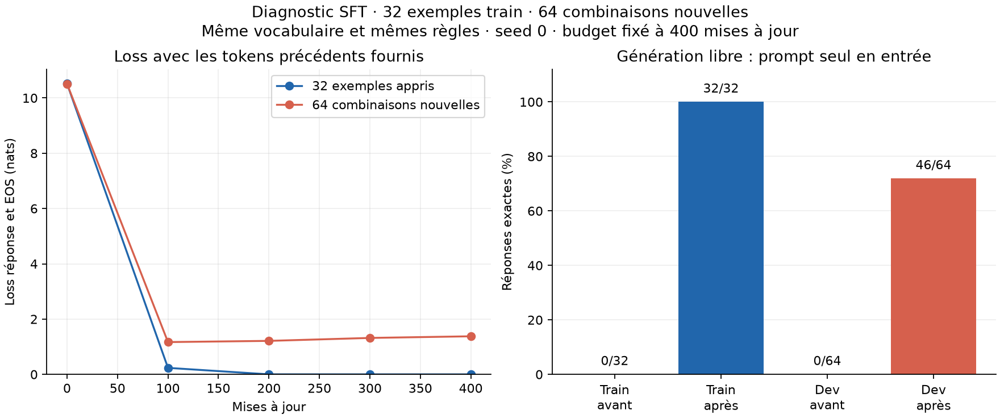

# Diagnostic SFT : mémorisation complète, généralisation partielle

Essai terminé le **28 septembre 2026**. Le modèle généraliste, adapté sur
32 exemples simples, réussit **32/32 exemples appris**, puis **46/64
combinaisons nouvelles (71,875 %)** en génération libre. Toutes ses sorties
finales se terminent par EOS. Le critère de mémorisation fixé avant le run
est atteint ; la généralisation reste inégale selon la tâche.

| Tâche | Train avant | Train après | Dev avant | Dev après |
| --- | ---: | ---: | ---: | ---: |
| Copier un mot | 0/8 | **8/8** | 0/16 | **10/16** |
| Extraire une couleur | 0/12 | **12/12** | 0/24 | **24/24** |
| Extraire un prénom | 0/12 | **12/12** | 0/24 | **12/24** |
| Total | 0/32 | **32/32** | 0/64 | **46/64** |

Les prompts sont donnés seuls, sans réponse attendue. Le score est la
correspondance exacte normalisée, avec génération greedy et budget de
8 nouveaux tokens, EOS compris. Le train mesure ici la **mémorisation** ;
il ne constitue pas une validation indépendante.



À gauche, la loss est mesurée avec les tokens précédents de la réponse
de référence fournis au modèle. À droite, le modèle produit seul la
réponse complète. Ces deux mesures répondent à des questions différentes.

## Ce que révèlent les erreurs

Les 64 exemples nouveaux partagent les mêmes gabarits, règles et mots
possibles avec le train, mais utilisent des **associations différentes**.
Prompts complets et contextes sont disjoints entre train et dev.
Ce score ne mesure donc pas la compréhension de consignes générales ou
la réussite sur des formulations et mots inconnus.

Pour les couleurs, le modèle répond correctement aux **deux questions
opposées dans chacun des 12 contextes nouveaux** : couleur de la lanterne
et couleur du panier. Cette réussite dépasse la répétition d’une couleur
fréquente ou la sélection systématique du premier objet.

Pour les prénoms, il réussit les **12 questions sur la clé** et échoue aux
**12 questions sur la carte**. Dans chacune de ces 12 erreurs, le prénom
produit est exactement celui qui était associé, dans le train, à la
personne actuellement citée comme possédant la clé.

Exemple :

- Train : `Alice has the key. Bruno has the map.` → pour la carte : `Bruno`.
- Dev : `Alice has the key. Clara has the map.` → attendu : `Clara`.
- Réponse générée sur ce dev : **`Bruno`**.

Les sorties sont compatibles avec la mémorisation de l’association
Alice → Bruno, et de cinq associations analogues, au lieu d’une extraction
correcte de la personne possédant la carte dans le nouveau contexte.
Cette interprétation décrit un comportement observé ; elle ne prouve pas
le mécanisme interne exact du modèle.

La copie de mots échoue aussi sur six cas. Par exemple, avec
`Target word: stone / Other word: bread`, le modèle produit `apple`.
Le format bref est respecté, mais le contenu demandé n’est pas toujours suivi.

Toutes les [générations avant/après](sft-diagnostic-32-64-generations.json)
sont publiques, car ces exemples sont créés pour le laboratoire.
L’[analyse par tâche et par paire de questions](sft-diagnostic-32-64-analysis.json)
conserve les décomptes. Une réponse constante par tâche, choisie comme la
plus fréquente dans le train, obtiendrait **10/64**, contre 46/64 observés.

## Loss et conservation des capacités générales

| Mise à jour | Loss train, 70 cibles | Loss dev, 140 cibles |
| --- | ---: | ---: |
| 0 | 10,515088 | 10,508716 |
| 100 | 0,235747 | 1,168572 |
| 200 | 0,001692 | 1,212340 |
| 300 | 0,000252 | 1,318683 |
| 400 | 0,000097 | 1,377993 |

La loss train approche zéro, tandis que la loss dev remonte après la
première évaluation. La perplexité dev diagnostique finale est de **3,97**.
Les 70 et 140 cibles incluent des EOS et quelques prénoms à plusieurs tokens :
l’accuracy par token, 100 % sur train et 87,14 % sur dev, ne se confond pas
avec le taux de réponses complètes exactes.

Sur les **999 999 cibles du dev général**, la loss passe de **5,216053 à
6,904757**, et la perplexité de **184,21 à 997,01**, soit **×5,41**.
Ce test poussé de mémorisation dégrade donc fortement la référence générale.
Son checkpoint sert au diagnostic ; **le modèle généraliste initial reste
la référence**. Aucun holdout n’a été évalué.

## Protocole, durée et limites

Le [protocole fixé avant l’expérience](../experiments/sft_diagnostic.md),
la [configuration](../experiments/sft_diagnostic_config.json), les
[96 exemples](../experiments/sft_diagnostic_examples.json), le
[manifeste](sft-diagnostic-32-64-manifest.json) et l’[audit des données](sft-diagnostic-32-64-data-audit.json)
permettent de reproduire l’essai.

Le modèle 94 124 928 paramètres repart du checkpoint généraliste préentraîné
sur 50 M de tokens. Même pipeline SFT que Dolly, avec loss réponse/EOS,
poids et AdamW FP32, opérations éligibles BF16, évaluations FP32, contexte
maximal 256. Les séquences réelles font au plus 33 tokens.

Budget : **100 passes sur les 32 exemples**, batch 8, **400 mises à jour**,
3 200 présentations, **7 000 cibles réponse/EOS** et 101 600 tokens non paddés.
AdamW neuf : pic `3e-4`, warmup 20 mises à jour, cosinus jusqu’à `3e-5`,
weight decay nul, clipping à 1, seed 0. Le point final n’a pas été choisi
après consultation du dev.

La boucle d’entraînement a pris **45,31 secondes**, hors évaluations et
sauvegardes. Durée interne du runner : **169,61 secondes** ; durée du
processus : **181,62 secondes** ; intervalle entre horodatages UTC du
lanceur : **199,78 secondes**. Pic CUDA alloué pendant la boucle et ses
évaluations intermédiaires : **2,95 Gio** ; évaluation finale : **1,90 Gio**.
GPU RTX 4060 Laptop 8 Gio, PyTorch `2.10.0+cu128`, Python `3.11.14`.

Le nombre d’exemples, leur difficulté, le taux d’apprentissage et le nombre
de passes diffèrent de l’essai Dolly. **Ce n’est pas une ablation isolant
une cause de son échec.** Une seule seed a été testée et le dev diagnostique
est très petit et structuré. On ne déduit pas de ces résultats qu’un
préentraînement plus long serait inutile, ni qu’il serait la seule solution.

Le contrôle montre que notre pipeline peut mémoriser ces 32 exemples et
que ce modèle peut généraliser certaines règles simples dans ce cadre.
Il invite à tester la diversité des associations dans les données :
en particulier, faire rencontrer plusieurs partenaires à chaque prénom,
puis mesurer si l’erreur d’association persiste. Ce serait une expérience
suivante, avec budget contrôlé et cas d’évaluation exclus du train.

## Vérifications et artefacts

Les **197 tests passent** avec `python -m pytest tests -q`. Ils vérifient
notamment l’oracle textuel, la séparation des prompts et contextes, les
questions opposées, les proportions des réponses, le masque SFT, la reprise
et l’évaluation de splits complets avec ces nouvelles catégories.

L’audit de l’exécution confirme les compteurs, les hashes des données et
du code lancé, les mêmes prompts/références/budgets avant/après, le score
général initial exactement identique à la référence, le checkpoint source
inchangé, l’égalité des poids finaux et de reprise, et un écart de logits
**strictement nul après rechargement**.

Dans les mesures du runner, **`probes` désigne les 32 exemples train** et
`dev_generation` les 64 combinaisons nouvelles. Cette convention est
documentée dans le protocole et la provenance.

- Code d’entraînement : `ee3d5c72a3b3be6e67ae58e191cd52e1791d5c31`.
- [Mesures](sft-diagnostic-32-64.json), [provenance](sft-diagnostic-32-64-execution.json), [courbes SVG](sft-diagnostic-32-64.svg).
- Run local : `runs/sft-gi30rb8x/`, modèle `model.pt` et sauvegarde `recovery.pt`.
- Lanceur local : `runs/sft-diagnostic-launch-nar1z4e0/`.
- Checkpoint source préservé : `runs/simple-baseline-2fsdgx0q/model.pt`.

Reproduire la figure :

```sh
python -m evaluation.plot_sft_diagnostic results/sft-diagnostic-32-64.json \
  --output-prefix results/sft-diagnostic-32-64
```
