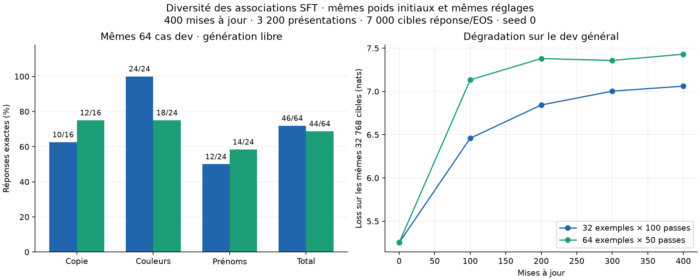

# Diversité des associations SFT : pas de gain global sur cet essai

Comparaison terminée le **29 septembre 2026**. Doubler le nombre d’associations
distinctes à budget d’entraînement égal donne **44/64 réponses correctes**,
contre **46/64** avec le premier jeu de 32 exemples. Le modèle mémorise les
**64/64 exemples train**, mais la généralisation ne progresse pas globalement.
La qualité statistique sur les textes généraux se dégrade davantage.

| Mêmes cas dev, génération libre | Référence : 32 exemples train | Variante : 64 exemples train |
| --- | ---: | ---: |
| Copier un mot | 10/16 | **12/16** |
| Extraire une couleur | 24/24 | **18/24** |
| Extraire un prénom | 12/24 | **14/24** |
| Total | **46/64 — 71,875 %** | **44/64 — 68,75 %** |
| Questions sur la personne possédant la carte, incluses dans les prénoms | 0/12 | **2/12** |

Sur les mêmes 64 cas, **quatre erreurs sont corrigées et six réponses
auparavant correctes deviennent fausses**, soit deux réussites de moins
et −3,125 points de pourcentage. Toutes les sorties finales, sur train
comme sur dev, se terminent par EOS.



La figure compare les réponses complètes à gauche et la loss sur les mêmes
32 768 cibles générales à droite. Les scores généraux complets, ci-dessous,
portent sur les 999 999 cibles du dev de référence.

## Une comparaison à budget égal

Le [protocole fixé avant le run](../experiments/sft_diversity.md) conserve
les mêmes poids initiaux généralistes, architecture, tokenizer, seed 0,
format des exemples, proportion des tâches et distribution des réponses.

| Budget | Référence | Variante |
| --- | ---: | ---: |
| Exemples train uniques | 32 | 64 |
| Passes | 100 | 50 |
| Mises à jour, batch 8 | 400 | 400 |
| Présentations d’exemples | 3 200 | 3 200 |
| Cibles réponse/EOS | 7 000 | 7 000 |
| Tokens non paddés | 101 600 | 101 600 |

Le calendrier d’AdamW est exactement le même à chaque mise à jour : pic
`3e-4`, warmup 20, cosinus jusqu’à `3e-5`, weight decay nul, clipping à 1.
L’entraînement utilise BF16 pour les opérations éligibles, avec poids et
optimiseur FP32, puis évaluations FP32. Les paramètres du modèle ne changent
pas : 94 124 928.

Le nouveau train garde les 32 exemples originaux et ajoute une deuxième
association pour chaque valeur. Les gabarits et l’ordre des phrases ne
changent pas. Chaque exemple est vu moitié moins souvent ; l’ordre des
présentations et la composition des batches changent avec le nouveau train.

Le fichier dev est **identique octet pour octet** à celui de la référence.
Les 64 prompts, réponses attendues, budgets de génération et leurs scores
initiaux sont également identiques. Les modèles partent tous deux du
checkpoint généraliste ; la variante ne continue pas le modèle du premier
diagnostic. Le point final reste la mise à jour 400, sans sélection après
consultation des scores.

## Le raccourci sur les prénoms persiste

Les questions sur la clé restent correctes : **12/12** dans les deux essais.
Les questions sur la carte passent de 0/12 à 2/12. Pour les **dix réponses
encore fausses**, le prénom produit correspond toujours à l’un des deux
partenaires rencontrés avec le détenteur de la clé dans le nouveau train.
Six de ces sorties correspondent au partenaire du train original.

Exemple sur un même cas dev :

- contexte : `Alice has the key. Clara has the map.` ;
- consigne : `Who has the map? Reply with one name.` ;
- réponse attendue : `Clara` ;
- modèle entraîné sur 32 exemples : `Bruno` ;
- modèle entraîné sur 64 exemples : **`Emma`**.

Le train original associe Alice à Bruno ; le nouveau train ajoute Alice
avec Emma. La sortie change, mais ne suit toujours pas la relation demandée
dans ce contexte. Ce comportement est compatible avec des associations
mémorisées ; il ne prouve pas le mécanisme interne exact.

Les deux questions d’un même contexte sont correctement résolues dans
**2/12 contextes de prénoms**, contre 0/12 précédemment. Pour les couleurs,
ce nombre recule de 12/12 à **6/12** : les six régressions concernent la
couleur de la lanterne. La copie gagne deux cas, sans perdre de réussite
antérieure. Les [IDs des gains et régressions](sft-diversity-64-64-analysis.json)
et les [générations complètes](sft-diversity-64-64-generations.json) sont archivés.

## La loss baisse sans hausse du score exact

| Mesure finale | Référence 32 | Variante 64 |
| --- | ---: | ---: |
| Loss dev SFT, 140 cibles | 1,377993 | **0,485157** |
| Perplexité dev SFT | 3,966931 | **1,624430** |
| Accuracy par token avec tokens de référence précédents | 87,14 % | **85,71 %** |
| Réponses complètes exactes en génération libre | 46/64 | **44/64** |
| Loss générale, 999 999 cibles | 6,904757 | **7,297671** |
| Perplexité générale | 997,01 | **1 476,86** |

La loss mesure les probabilités attribuées aux tokens de référence ; le
score exact mesure les réponses effectivement choisies par génération
greedy. Ces résultats montrent pourquoi une baisse de loss ne suffit pas
à conclure à davantage de réponses correctes. Elle ne prouve pas non plus,
à elle seule, une meilleure calibration.

La perplexité générale initiale est **184,21** dans les deux runs. La
variante atteint **1 476,86**, soit ×8,02 par rapport au modèle initial et
+48,13 % par rapport au checkpoint final du premier diagnostic. Le
checkpoint généraliste reste donc la référence. **Aucun holdout n’a été
évalué**.

## Interprétation et limites

Dans cette configuration et sur cette seed, passer d’un à deux partenaires
par valeur **ne suffit pas à améliorer le score global**, ni à éliminer les
erreurs d’association sur les prénoms. Les deux conditions mémorisent
parfaitement leur train, tandis que certaines combinaisons inédites échouent.

Le dev est petit, structuré, et déjà connu lors de la formulation de cette
hypothèse. Les gabarits et le vocabulaire sont partagés entre train et dev.
Deux réussites de moins sur 64 cas et une seule seed ne permettent pas
d’affirmer que la diversité des données serait généralement nuisible.
L’essai ne sépare pas non plus l’effet des nouvelles associations de celui
du changement de composition des batches. Il ne démontre pas que davantage
de préentraînement serait nécessaire ou suffisant.

Ce résultat négatif est conservé tel quel : aucune autre variante n’a été
essayée ensuite pour sélectionner un score plus favorable.

## Exécution et vérifications

La boucle d’entraînement prend **37,38 secondes**, hors évaluations et
sauvegardes ; le runner complet **163,60 secondes**, le processus
**175,44 secondes**, et l’intervalle entre horodatages UTC **190,62 secondes**.
Les durées ne constituent pas un benchmark de débit contrôlé entre les deux
jours d’exécution. Le pic CUDA alloué est de **2,95 Gio** pendant la boucle
et ses évaluations intermédiaires, puis **1,90 Gio** pendant l’évaluation
finale. GPU RTX 4060 Laptop 8 Gio, PyTorch `2.10.0+cu128`.

Les **199 tests passent** (`python -m pytest tests -q`). L’audit vérifie
les 128 réponses et leur encodage, la séparation des contextes, le dev
inchangé, les budgets, les identités du code d’entraînement et d’évaluation
entre les deux expériences, ainsi que le calendrier d’apprentissage.

La préparation originale reproduit ses fichiers et son manifeste octet
pour octet. Le checkpoint source reste inchangé. Les poids finaux égalent
ceux de la sauvegarde de reprise, et le rechargement du modèle final donne
un **écart maximal de logits nul**.

- Code du run : `624ab1c02c9bf734bfda03c968ad16504d4b66c8`.
- [Configuration](../experiments/sft_diversity_config.json), [exemples](../experiments/sft_diversity_examples.json), [manifeste](sft-diversity-64-64-manifest.json), [audit des données](sft-diversity-64-64-data-audit.json).
- [Mesures](sft-diversity-64-64.json), [provenance et contrôles de comparaison](sft-diversity-64-64-execution.json), [analyse détaillée](sft-diversity-64-64-analysis.json), [courbes SVG](sft-diversity-64-64.svg).
- Référence conservée : [premier diagnostic 32/64](sft-diagnostic-32-64.md).
- Run local : `runs/sft-qrk4c22k/`, avec `model.pt` et `recovery.pt`.
- Lanceur : `runs/sft-diversity-launch-u20lzybd/`.
- Source généraliste intacte : `runs/simple-baseline-2fsdgx0q/model.pt`.

Reproduire la figure :

```sh
python -m evaluation.plot_sft_diversity \
  results/sft-diagnostic-32-64.json results/sft-diversity-64-64.json \
  --output-prefix results/sft-diversity-64-64
```
