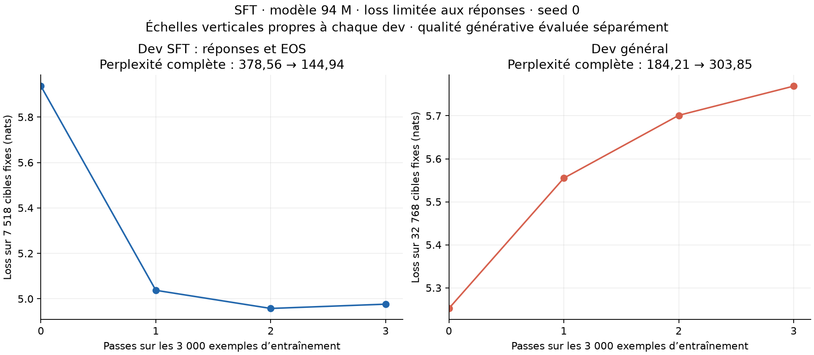

# Premier SFT : apprentissage du format, consignes encore ratées

Essai terminé le **28 septembre 2026**, après reprise des évaluations à la suite
d’un crash de l’ordinateur. Les trois passes étaient déjà sauvegardées :
**aucune mise à jour supplémentaire n’a été effectuée à la reprise**.

Le modèle prédit mieux les réponses du dev SFT et apprend plus souvent à
terminer sa sortie. Il reste toutefois incapable de réussir les **12 consignes
simples du diagnostic**. Sa qualité statistique sur le dev général se dégrade.
Ce premier SFT valide le pipeline pédagogique, sans fournir un assistant utile.

## Mesures avant/après

| Dev complet | Cibles évaluées | Loss avant | Loss après | Perplexité avant | Perplexité après | Variation de perplexité |
| --- | ---: | ---: | ---: | ---: | ---: | ---: |
| Réponses SFT, EOS compris | 7 518 | 5,936363 | 4,976328 | 378,56 | **144,94** | **−61,71 %** |
| Général | 999 999 | 5,216053 | 5,716541 | 184,21 | **303,85** | **+64,95 %** |

Chaque comparaison utilise les mêmes cibles avant/après. Le score général
initial reproduit exactement la [référence 94 M / 50 M tokens](pretraining-50m.md).
Les deux devs ont des difficultés et des objectifs différents : leurs
perplexités ne se comparent pas directement entre elles.

L’accuracy par token sur les réponses SFT passe de **24,87 % à 36,01 %**.
Elle est calculée avec les tokens précédents de la réponse attendue fournis
au modèle (*teacher forcing*), ce qui ne mesure pas la réussite en génération libre.



La courbe SFT porte sur les 7 518 cibles du dev complet ; la courbe générale
sur les mêmes 32 768 cibles fixes à chaque époque. Les scores généraux en
titre et dans le tableau utilisent le million de tokens dev complet. Les
échelles verticales sont distinctes.

| Passes terminées | Loss train, échantillon fixe | Loss dev SFT | Perplexité dev SFT |
| --- | ---: | ---: | ---: |
| 0 | 5,970273 | 5,936363 | 378,56 |
| 1 | 4,688223 | 5,037339 | 154,06 |
| 2 | 4,239729 | 4,957500 | 142,24 |
| 3 | 4,100787 | 4,976328 | 144,94 |

Le gain dev ralentit puis s’inverse légèrement à la troisième passe, alors
que la loss train continue de baisser. L’écart train/dev se creuse. Le point
final reste la troisième passe fixée dans le protocole : le meilleur point
dev n’a pas été sélectionné après coup. Le dev général se dégrade dès la
première passe.

## Réponses générées

Les prompts, réponses de référence et budgets de génération sont identiques
avant/après. Le modèle reçoit uniquement la consigne et son contexte : aucun
token de la réponse attendue n’est donné en entrée.

| Mesure en génération greedy | Avant | Après |
| --- | ---: | ---: |
| Correspondances exactes normalisées, 24 exemples Dolly dev | 0/24 | 0/24 |
| F1 lexical moyen, mêmes 24 exemples | 0,0914 | 0,1802 |
| Sorties terminées par EOS, mêmes 24 exemples | 0/24 | 16/24 |
| Fraction moyenne de 4-grammes de tokens répétés, mêmes 24 exemples | 64,66 % | 29,94 % |
| Correspondances exactes, 12 sondes du laboratoire | 0/12 | 0/12 |
| F1 lexical moyen, mêmes 12 sondes | 0 | 0 |
| Sorties terminées par EOS, mêmes 12 sondes | 0/12 | 8/12 |

La répétition diminue et l’arrêt à EOS apparaît : le format des réponses
évolue. Le F1 lexical mesure le recouvrement des mots, pas la correction
sémantique. La correspondance exacte peut manquer une paraphrase correcte,
en particulier sur les résumés Dolly. Ces 24 exemples ne constituent pas une
estimation robuste de capacité générale.

Les [12 sondes propres au laboratoire](../experiments/sft_probes.json)
demandent des réponses très courtes et explicites. Elles montrent des
échecs concrets, au-delà du seul score exact. Quelques sorties finales :

| Consigne résumée | Attendu | Sortie du modèle après SFT |
| --- | --- | --- |
| Qui possède la clé, selon le contexte ? | `Leo` | `The name of the name is the name of the name.` |
| Classer 12 selon la règle « > 10 : large, sinon small » | `large` | `The list of items that are not.` |
| Donner le dernier mot de « The yellow door is open » | `open` | `The percussion string is a string.` |

Les sorties avant/après des 12 sondes sont intégralement conservées dans les
[mesures JSON](sft-dolly-3k.json). Les prompts et réponses détaillés issus de
Dolly restent dans les fichiers locaux de génération ; seuls leurs IDs et
scores sont publiés ici.

## Protocole et reprise après crash

Le [protocole](../experiments/sft_dolly.md) et la
[configuration](../experiments/sft_dolly_config.json) repartent du checkpoint
**généraliste**, avant l’adaptation Python : 94 124 928 paramètres, contexte
256, batch 8, RoPE/GQA/SDPA, entraînement BF16 et évaluation FP32. La loss
supervise uniquement la réponse et son EOS. AdamW est neuf, avec pic `5e-5`,
warmup 50 mises à jour puis cosinus jusqu’à `5e-6`.

Les **3 000 exemples uniques** sont parcourus trois fois : **9 000
présentations**, **1 125 mises à jour**, **246 798 cibles réponse/EOS** et
**1 084 770 tokens non paddés**. Le [manifeste](sft-dolly-3k-manifest.json)
et l’[audit des données](sft-dolly-3k-data-audit.json) documentent la source
Dolly épinglée, sa licence CC BY-SA 3.0, les filtres et les splits groupés.
Les annotations ne sont pas toutes certifiées correctes et les patrons de
classification restent fréquents.

Le crash signalé par l’utilisateur s’est produit pendant l’évaluation
finale. La sauvegarde atomique de fin de troisième passe est intacte : tous
ses tenseurs sont finis. Le modèle final exporté après reprise contient
**exactement les mêmes poids**. Le score dev SFT final reproduit exactement
celui enregistré avant le crash. La cause du crash n’a pas été établie.

Le runner sauvegarde désormais le modèle d’inférence avant l’évaluation
finale, libère AdamW et les gradients avant cette phase, et ne charge pas
l’optimiseur lors d’une reprise à la dernière mise à jour. Les logits SFT
temporaires sont également libérés avant le batch d’évaluation suivant.
Ces changements n’altèrent ni les poids ni le protocole d’évaluation.

La reprise a demandé **99,14 secondes dans le runner**, **113,30 secondes
au chronomètre du processus**, et **128,18 secondes entre les horodatages
UTC du lanceur**. Le pic de mémoire CUDA allouée pendant l’évaluation finale
est de **1,89 Gio** ; ce compteur n’inclut pas toute la mémoire réservée par
PyTorch ou utilisée par le système. GPU : RTX 4060 Laptop 8 Gio, PyTorch
`2.10.0+cu128`, Python `3.11.14`.

Les durées complètes et le pic mémoire de l’entraînement initial n’ont pas
été finalisés avant le crash. Ils restent **inconnus** dans le rapport.
Le dernier journal indique 435,06 secondes depuis le démarrage interne du
runner jusqu’à la dernière mise à jour, en incluant notamment les évaluations
antérieures ; ce chiffre ne représente ni le temps de boucle seul ni la durée
totale de l’expérience. Aucune vitesse globale n’en est déduite.

## Conclusion et vérifications

La partie **SFT du jalon 6 est implémentée et mesurée**. Le modèle apprend
des régularités de réponses et leur terminaison, mais ce petit essai ne
démontre pas une capacité à suivre les consignes. La dégradation générale
et les échecs des sondes empêchent de présenter ce checkpoint comme une
amélioration globale. Le checkpoint généraliste reste la référence.

Une seule seed et une seule recette ont été testées. Cet essai ne permet
pas d’isoler l’effet du taux d’apprentissage, du nombre de passes, de la
source de données ou des capacités initiales. **Aucun holdout n’a été
évalué**. Les ablations et l’évaluation finale restent au jalon 7.

Les **190 tests du laboratoire passent** (`python -m pytest tests -q`), dont
un test simulant une interruption pendant l’évaluation finale et vérifiant
la reprise sans optimiseur, sans mise à jour et sans changement de poids.
L’audit confirme les compteurs, les prompts/budgets avant/après, les identités
des données, les checkpoints source et de reprise inchangés, ainsi qu’un
**écart maximal de logits nul** après rechargement du modèle final.

- Code d’entraînement : `05584b19a7a4947c99d266363e2ea5b86d7bd8e6`.
- Code de reprise : `aa450d949783d786aff910f7df622849bf163376`.
- [Provenance et hashes](sft-dolly-3k-execution.json), [mesures](sft-dolly-3k.json), [courbes SVG](sft-dolly-3k.svg).
- Run initial local : `runs/sft-qj4xus9t/`, sauvegarde `recovery.pt` conservée.
- Run de reprise : `runs/sft-kw1rxok0/`, modèle final local `model.pt`.
- Checkpoint généraliste : `runs/simple-baseline-2fsdgx0q/model.pt`, conservé intact.

Reproduire le graphique :

```sh
python -m evaluation.plot_sft results/sft-dolly-3k.json \
  --output-prefix results/sft-dolly-3k
```
