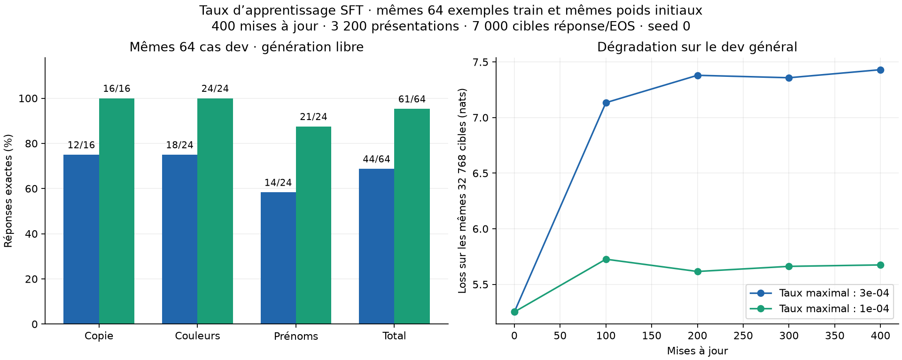

# SFT : un taux réduit améliore nettement le résultat de cet essai

Expérience terminée le **29 septembre 2026**. Avec les mêmes données et
le même budget, diviser le taux d’apprentissage par trois fait passer
le score dev de **44/64 à 61/64**. La perplexité générale finale baisse
de **1 476,86 à 272,98**, mais reste supérieure aux **184,21** du modèle
initial. Le compromis s’améliore sur ce diagnostic ; l’oubli demeure.

| Mêmes cas dev, génération libre | Pic `3e-4` | Pic `1e-4` |
| --- | ---: | ---: |
| Copier un mot | 12/16 | **16/16** |
| Extraire une couleur | 18/24 | **24/24** |
| Extraire un prénom | 14/24 | **21/24** |
| Total | 44/64 — 68,75 % | **61/64 — 95,3125 %** |
| Questions sur la carte, incluses dans les prénoms | 2/12 | **9/12** |
| Mémorisation des exemples train, mesurée séparément | 64/64 | **64/64** |

Les deux essais commencent à 0/64 sur ce dev. Par rapport au taux élevé,
**18 erreurs sont corrigées et une réponse correcte devient fausse** :
gain net de 17 cas, soit **26,5625 points de pourcentage**. Toutes les
sorties finales sur train et dev se terminent par EOS.



La courbe générale porte sur le même échantillon fixe de 32 768 cibles.
Les perplexités complètes ci-dessous utilisent les 999 999 cibles du dev
général ; elles ne sont pas calculées sur le seul échantillon de la figure.

## Ce qui change et ce qui est contrôlé

Le [protocole](../experiments/sft_learning_rate.md) et la
[configuration](../experiments/sft_learning_rate_config.json) ont été
commités avant le lancement. Le seul paramètre d’entraînement modifié
est `optimizer.lr` : **`3e-4 → 1e-4`**. Avec le même warmup de 20
mises à jour, le même cosinus et le même plancher relatif de 0,1,
chacun des 400 taux est divisé par trois ; le taux final est `1e-5`.

Les deux essais partent des mêmes poids généralistes **94 M / 50 M tokens**,
avec AdamW neuf. Ils utilisent exactement les mêmes fichiers train,
dev et probes, la seed 0, l’ordre des exemples et les batches, ainsi que
le même code d’entraînement et d’évaluation. Le format, le tokenizer,
le contexte de 256 tokens et les précisions BF16/FP32 restent identiques.

Budget : **64 exemples train × 50 passes**, batch 8, **400 mises à jour**,
**3 200 présentations**, **7 000 cibles réponse/EOS**, **101 600 tokens
non paddés**. Le point final à 400 était fixé avant l’essai. Aucun arrêt
anticipé, prolongement ou choix de checkpoint selon les scores n’a eu lieu.
La référence à taux élevé est le run déjà archivé.

Les 64 prompts dev, références et budgets de génération sont identiques.
Les poids initiaux, tous les scores et toutes les générations initiales
sont également identiques entre les deux runs. La génération est greedy,
avec un budget de huit nouveaux tokens.

## Les trois erreurs restantes

Les questions sur la clé restent correctes : **12/12**. Les trois erreurs
concernent la carte ; les deux questions d’un même contexte sont réussies
dans **9/12 contextes de prénoms**, contre 2/12 auparavant. Pour les
couleurs, les deux questions sont désormais réussies dans **12/12 contextes**.

Exemple corrigé : pour `Alice has the key. Clara has the map.`, à la
question `Who has the map?`, la réponse passe de **Emma** à **Clara**.

| ID dev | Contexte : clé / carte | Attendu | Sortie à `3e-4` | Sortie à `1e-4` |
| --- | --- | --- | --- | --- |
| val-name-24 | Bruno / David | David | David | **Bruno** |
| val-name-32 | Felix / Bruno | Bruno | Alice | **David** |
| val-name-58 | Clara / Felix | Felix | David | **Emma** |

Le premier cas est l’unique régression. Les deux autres restent faux,
avec une sortie différente. Les [IDs des changements](sft-learning-rate-1e-4-analysis.json)
et les [générations complètes avant/après](sft-learning-rate-1e-4-generations.json)
permettent de vérifier ces observations.

## Conservation du comportement général

| Mesure | Initial commun | Final `3e-4` | Final `1e-4` |
| --- | ---: | ---: | ---: |
| Loss générale, 999 999 cibles | 5,216053 | 7,297671 | **5,609395** |
| Perplexité générale | 184,21 | 1 476,86 | **272,98** |
| Perplexité des réponses dev SFT, 140 cibles | 36 633,43 | 1,624430 | **1,061598** |

La perplexité générale reste **48,19 % au-dessus de l’initial**. Cette
mesure évalue la prédiction de textes généraux ; elle ne résume pas toutes
les capacités du modèle. Le checkpoint généraliste est conservé intact.

Le taux réduit apprend plus lentement au début, mais atteint au point
final 64/64 sur le train et un meilleur score sur les combinaisons dev.
Cet essai montre qu’une adaptation trop forte était une piste pertinente
à tester ; il n’établit pas que `1e-4` soit un taux optimal universel.

## Portée et limites

Le dev contient des combinaisons absentes du train, avec des gabarits
et un vocabulaire partagés. Il est petit et déjà connu lors du choix de
l’expérience. Le résultat ne démontre donc pas un suivi fiable de consignes
variées ou une capacité générale de dialogue.

Une seule seed et un seul taux supplémentaire ont été essayés.
**Aucun holdout réservé n’a été évalué.** Les deux conditions ont été
comparées avec le même budget et les mêmes données ; aucune autre
modification d’entraînement n’accompagne la baisse du taux.

## Exécution et vérifications

La boucle d’entraînement prend **37,79 secondes** hors évaluations et
sauvegardes. Le runner complet prend **157,29 secondes**, le processus
**171,75 secondes**. Ces durées ne constituent pas un benchmark contrôlé.
Le pic CUDA alloué est de **2,95 Gio** pendant la boucle et ses évaluations
intermédiaires, puis **1,90 Gio** pendant l’évaluation finale.
GPU RTX 4060 Laptop 8 Gio, PyTorch `2.10.0+cu128`.

L’audit après exécution vérifie les identités du code et des données,
les 400 taux, les budgets et les générations comparables. Il confirme
que les poids finaux sont finis et identiques à ceux de la sauvegarde
de reprise. Le rechargement produit un **écart maximal de logits nul**,
et le checkpoint source reste inchangé.

La suite du code d’entraînement inchangé avait **199 tests réussis** lors
de l’expérience précédente. Elle n’a pas été relancée pour cette seule
modification de configuration ; l’audit de ce run et la génération de sa
figure ont été exécutés avec succès.

- Code du run : `2d58cc6624eb603e61cbd715957d9eb2481560b6`.
- [Mesures](sft-learning-rate-1e-4.json), [provenance et vérifications](sft-learning-rate-1e-4-execution.json), [analyse](sft-learning-rate-1e-4-analysis.json), [figure SVG](sft-learning-rate-1e-4.svg).
- Données réutilisées : [exemples](../experiments/sft_diversity_examples.json), [manifeste](sft-diversity-64-64-manifest.json), [audit des données](sft-diversity-64-64-data-audit.json).
- Référence à `3e-4` : [rapport précédent](sft-diversity-64-64.md).
- Run local : `runs/sft-duplqurm/`, avec `model.pt` et `recovery.pt`.
- Lanceur : `runs/sft-learning-rate-launch-lzpeklla/`.
- Source généraliste intacte : `runs/simple-baseline-2fsdgx0q/model.pt`.

Reproduire la figure :

```sh
python -m evaluation.plot_sft_diversity \
  results/sft-diversity-64-64.json results/sft-learning-rate-1e-4.json \
  --comparison learning-rate --output-prefix results/sft-learning-rate-1e-4
```
