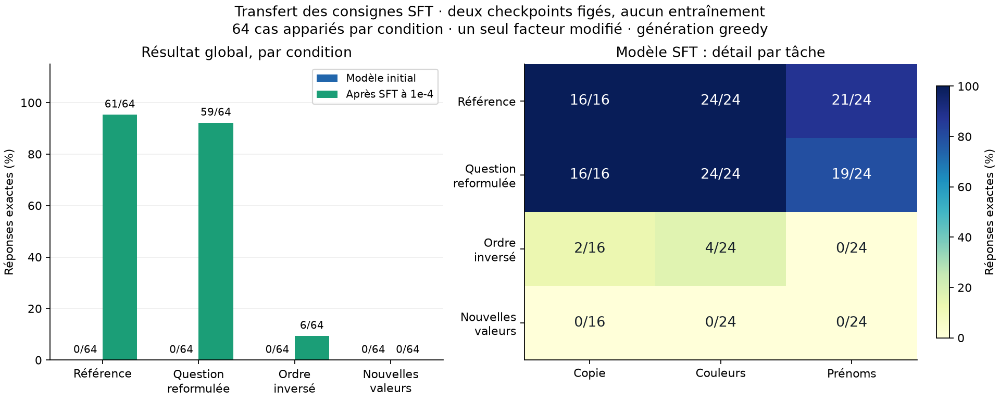

# Transfert SFT : forte dépendance à l’ordre et au vocabulaire appris

Diagnostic terminé le **1er octobre 2026**, sans nouvel entraînement.
Le modèle SFT conserve **59/64** réponses correctes avec les reformulations
testées, mais tombe à **6/64** après inversion des phrases et à **0/64**
avec de nouvelles valeurs. Les **61/64** du diagnostic précédent décrivaient
une réussite dans un cadre très restreint.

| Condition, 64 cas appariés | Modèle initial | Modèle SFT | Copie SFT | Couleurs SFT | Prénoms SFT |
| --- | ---: | ---: | ---: | ---: | ---: |
| Référence inchangée | 0/64 | **61/64** | 16/16 | 24/24 | 21/24 |
| Question reformulée | 0/64 | **59/64** | 16/16 | 24/24 | 19/24 |
| Ordre des phrases inversé | 0/64 | **6/64** | 2/16 | 4/24 | 0/24 |
| Nouvelles valeurs | 0/64 | **0/64** | 0/16 | 0/24 | 0/24 |



Le modèle SFT termine ses 64 réponses par EOS dans chacune des conditions.
Le modèle initial ne s’arrête à EOS sur aucun de ces cas et utilise les
huit tokens disponibles. L’apprentissage du format court est donc visible,
mais ne suffit pas à réussir l’extraction dans les nouveaux contextes.

## Une seule variation à la fois

Le [protocole fixé avant la mesure](../experiments/sft_transfer.md) compare
les checkpoints généraliste 94 M / 50 M tokens et SFT à taux maximal
`1e-4`, après 400 mises à jour. Les poids restent inchangés.

Les 64 exemples de chaque condition correspondent aux mêmes IDs dev.
La reformulation garde le contexte et la réponse ; l’inversion garde les
faits et l’instruction ; les nouvelles valeurs conservent gabarits, ordre
et relations, avec une substitution bijective des valeurs et des labels.
Les conditions ne combinent pas leurs modifications.

Les reformulations conservent la contrainte de réponse courte :
`Copy` devient `Return`, `Which color is the…?` devient
`What is the color of the…?`, et `Who has the…?` devient
`Which person has the…?`.

Les nouvelles valeurs sont absentes des réponses du petit train SFT.
Cela ne signifie pas qu’elles sont inconnues du préentraînement.
Les [exemples complets](../experiments/sft_transfer_examples.json) et le
[manifeste](../experiments/sft_transfer_manifest.json) sont versionnés.

## Cas corrects conservés et perdus

Le contrôle compte 61 réussites et trois erreurs. Aucune des variantes
ne corrige ces trois erreurs initiales.

| Variante | Réussites conservées parmi les 61 | Réussites perdues | Erreurs du contrôle corrigées |
| --- | ---: | ---: | ---: |
| Reformulation | 59 | 2 | 0 |
| Ordre inversé | 6 | 55 | 0 |
| Nouvelles valeurs | 0 | 61 | 0 |

Les deux régressions de reformulation sont `val-name-28` et
`val-name-54`, deux questions sur la carte. Les deux questions d’un même
contexte sont réussies dans 12/12 contextes de couleurs et 7/12 contextes
de prénoms, contre respectivement 12/12 et 9/12 au contrôle.

Après inversion, **aucun contexte de couleurs ou de prénoms n’a ses deux
questions réussies**. L’[analyse appariée](sft-transfer-v1-analysis.json)
archive tous les IDs perdus ou gagnés.

## Ce que révèlent les sorties

L’ordre des phrases change des réponses alors que les faits restent identiques.
Exemple apparié, question `Who has the key? Reply with one name.` :

| Contexte | Réponse attendue | Sortie SFT |
| --- | --- | --- |
| `Alice has the key. Clara has the map.` | Alice | **Alice** |
| `Clara has the map. Alice has the key.` | Alice | **Clara** |

La question sur la carte, dans ce même contexte inversé, reçoit **Alice**
au lieu de Clara. Cet exemple est compatible avec un raccourci fondé sur
la position ; il ne prouve pas un mécanisme interne unique pour tous les cas.

Pour la condition de nouvelles valeurs, **les 64 sorties appartiennent
au vocabulaire des anciennes réponses SFT de leur tâche**. Exemples :

| Tâche | Information demandée dans le contexte | Attendu | Sortie SFT |
| --- | --- | --- | --- |
| Copie | `Target word: table`, autre mot `garden` | table | **music** |
| Couleur de la lanterne | `The lantern is purple. The basket is pink.` | purple | **blue** |
| Détenteur de la clé | `Grace has the key. Irene has the map.` | Grace | **Emma** |

Ces réponses illustrent une restriction au vocabulaire appris malgré la
présence de la réponse dans le prompt. Les réponses attendues font un ou
deux tokens hors EOS et disposent d’un budget de huit tokens : leur longueur
ne les empêche pas d’être générées. La segmentation et la fréquence des mots
peuvent toutefois contribuer aux différences. Toutes les
[générations avant/après SFT](sft-transfer-v1-generations.json) sont publiées.

## Conséquence pour le prochain jeu SFT

La priorité suggérée par ce test est de varier les données en supprimant
les régularités qui permettent ces raccourcis :

- présenter chaque valeur et chaque relation dans les deux positions ;
- élargir fortement les mots, couleurs et prénoms, ainsi que leurs associations ;
- varier les formulations tout en gardant des réponses vérifiables ;
- préparer un dev séparant les combinaisons, puis des tests de transfert
  avec des formulations et des valeurs absentes du prochain train.

Cette suite est une proposition issue du diagnostic. Aucun entraînement
supplémentaire n’a été lancé. Les probes publiés deviennent des données
de développement connues ; réutiliser leurs valeurs pour entraîner exigera
de nouveaux cas réservés pour mesurer le transfert.

## Limites et vérifications

Il s’agit d’un petit diagnostic structuré : une reformulation par gabarit,
une inversion et une liste de substitutions, sur une seule lignée de
checkpoints. Les conditions sont appariées et corrélées ; leurs scores
ne sont pas regroupés en un échantillon indépendant de 256 cas.
**Aucun holdout réservé n’a été lu ni évalué.**

Les **37 tests ciblés passent** :

```sh
python -m pytest tests/test_sft_transfer.py tests/test_sft_diagnostic.py tests/test_sft.py -q
```

Ils couvrent notamment les labels, les facteurs modifiés, les comparaisons
appariées, le budget de génération, le contrôle des tokens reproduits et le
pipeline SFT existant. La préparation valide les 256 prompts avec un oracle
textuel et vérifie l’absence de prompts du train.

Les deux contrôles reproduisent **exactement toutes les générations
historiques**, pas seulement leurs scores. L’audit après exécution vérifie
les 512 prompts, réponses de référence, budgets et scores, ainsi que les
empreintes inchangées du code, des données et des deux checkpoints.

Le runner prend **71,15 secondes**, dont 51,56 s pour le modèle initial
et 16,69 s pour le SFT, chargements inclus. L’arrêt plus précoce à EOS du
SFT contribue à cette différence ; ce n’est pas un benchmark de débit.
Le pic CUDA alloué reste inférieur à **0,39 Gio**, avec un modèle à la fois.

- Code de l’évaluation : `64a00a5` ; protocole et données commités avant la mesure.
- [Configuration](../experiments/sft_transfer_config.json), [runner](../evaluation/sft_transfer.py).
- [Métriques](sft-transfer-v1.json), [provenance et empreintes](sft-transfer-v1-execution.json), [analyse](sft-transfer-v1-analysis.json), [figure SVG](sft-transfer-v1.svg).
- Run local : `runs/sft-transfer-w442778u/`.
- Checkpoints conservés : `runs/simple-baseline-2fsdgx0q/model.pt` et `runs/sft-duplqurm/model.pt`.

Reproduire la figure :

```sh
python -m evaluation.plot_sft_transfer results/sft-transfer-v1-analysis.json \
  --output-prefix results/sft-transfer-v1
```
