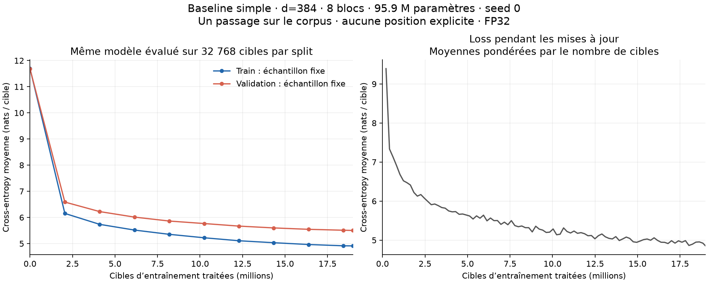

# Baseline de la réimplémentation simple

Expérience du 18 septembre 2026, avant l’ajout des mécanismes du jalon 3.
**Expérience terminée.** Le test de 200 mises à jour précédent validait le pipeline ;
cette expérience établit une référence avec un modèle plus large et un passage
complet sur le corpus existant. La loss sur la validation complète passe de
**11,677568 à 5,419455**, soit une perplexité finale de **225,756**.

[Mesures détaillées](simple-baseline.json), code d’entraînement au commit
`393343b1cd1ad294648a3025de40ab5aa2f83927`.

## Recette fixée avant l’entraînement

[Configuration versionnée](../reimplementation/baseline_config.json) et
[script d’entraînement](../reimplementation/train_baseline.py).

| Élément | Valeur |
|---|---:|
| Vocabulaire | 100 278 |
| Dimension d’embedding / du modèle | 384 |
| Matrice d’embedding | 100 278 × 384 = 38 506 752 paramètres |
| Blocs Transformer | 8 |
| Têtes par bloc | 8 × 48 dimensions |
| Dimension intermédiaire du MLP | 1 536 |
| Paramètres dans les blocs | 18 880 512 |
| Paramètres totaux | 95 894 400 |
| Longueur du contexte | 256 |
| Séquences par batch complet | 8 |
| Passages sur le corpus | 1 |
| Positions du corpus utilisées comme cibles | 18 999 999 |
| Mises à jour | 9 279 |

Les matrices d’embedding et de sortie sont indépendantes. Pas de RoPE, de
position explicite, de Q/K normalization, de GQA ou de mixed precision. Modèle
initialisé aléatoirement, calcul FP32, seed 0. Le tokenizer Dolma 2 reste identique
à celui des données, épinglé dans le code.

AdamW avec learning rate maximal de `3e-4`, betas `(0.9, 0.95)`, weight decay `0.1`
sur tous les paramètres, warmup linéaire de 100 mises à jour, décroissance cosinus
jusqu’à `3e-5`, clipping de la norme du gradient à 1.0. La recette sera identique
pour une comparaison future avec RoPE.

## Données et protocole

Les fichiers locaux de la baseline contiennent 19 millions de tokens de train et
1 million de validation. Ils restent en lecture seule ; leurs empreintes SHA-256
sont vérifiées avant et après. Aucun nouvel accès au holdout final.

Les fenêtres de train sont mélangées une fois, sans remise. Elles partagent un
token de contexte aux frontières, mais chaque cible est utilisée exactement une
fois. Le tout premier token n’a pas de contexte précédent ; les 18 999 999 autres
sont tous prédits, y compris les 191 cibles de la dernière fenêtre partielle.
La mémoire du modèle ne se prolonge pas d’une fenêtre à la suivante. Les documents
sont séparés par EOS ; une fenêtre peut traverser cette frontière.

Le fichier de validation complet est évalué avant et après : 999 999 cibles,
chacune comptée une fois, avec remise à zéro du contexte entre fenêtres. Pour
suivre les courbes, les mêmes 128 fenêtres fixes par split (32 768 cibles) sont
évaluées au départ, toutes les 1 000 mises à jour, et à la fin. Cette validation
sert au développement, pas à une évaluation finale indépendante.

Le script de préparation évite de partager un document entre train et validation,
mais cette expérience ne constitue pas un audit de doublons du corpus.

## Calibration sur le GPU local

RTX 4060 Laptop, 8 Go de VRAM, contexte de 256 tokens. Mesures courtes après trois
mises à jour de chauffe, avec le modèle complet et l’optimiseur ; ces poids de
calibration ne sont pas utilisés dans le véritable entraînement.

| Batch | Débit mesuré, cibles/s | Pic alloué par PyTorch | Durée estimée du passage |
|---|---:|---:|---:|
| 2 | 3 517 | 2,20 Go | 90 min |
| 4 | 7 126 | 3,23 Go | 44 min |
| 8, retenu | 9 583 | 5,28 Go | 33 min |

Débits mesurés sur 10 mises à jour pour les batches 2 et 4, sur 20 pour le batch 8.
Ce sont des estimations, hors évaluations et sauvegardes ; elles peuvent varier
avec l’état et la température du GPU. Le pic alloué n’est pas la mémoire GPU totale.
Les [mesures de calibration brutes](simple-baseline-calibration.json) sont conservées.

## Résultats du passage complet

| Mesure | Avant entraînement | Après 9 279 mises à jour |
|---|---:|---:|
| Loss sur toute la validation, 999 999 cibles | 11,677568 | **5,419455** |
| Perplexité sur toute la validation | 117 897,15 | **225,76** |
| Loss sur l’échantillon fixe de train, 32 768 cibles | 11,690875 | 4,911379 |
| Loss sur l’échantillon fixe de validation, 32 768 cibles | 11,674549 | 5,501702 |

La boucle d’entraînement a pris **2 165,53 s (36,09 min)**, hors évaluations et
sauvegardes. Le temps total enregistré, depuis l’évaluation initiale jusqu’aux
générations finales et au contrôle des données, est de **2 306,43 s (38,44 min)**.
Débit observé sur la boucle : **8 774 cibles/s**. Pic de mémoire allouée par PyTorch
pendant l’entraînement et les contrôles intermédiaires : **5 277 036 544 octets**
(5,28 Go, environ 4,91 Gio), distinct de la mémoire totale réservée ou utilisée
sur le GPU. PyTorch 2.10.0+cu128, NumPy 2.4.6, précision de matmul `highest`.

La dernière fenêtre de 191 cibles est incluse. Les compteurs du parcours et des
logs totalisent exactement **18 999 999 cibles**. Les SHA-256 des deux fichiers
de données sont identiques avant et après.



[Version SVG](simple-baseline-curves.svg). À gauche : évaluations avec les poids
du modèle fixés à chaque point, sur les mêmes fenêtres de train et de validation.
À droite : moyennes des losses avant mise à jour sur des batches successifs,
pendant que les poids changent. Les deux panneaux décrivent des mesures différentes.

## Checkpoint et génération

Le checkpoint final a été rechargé dans un nouveau modèle : **écart maximal de
logits = 0** sur la séquence de contrôle. La première génération a également été
reproduite à l’identique dans un processus Python séparé.

Les trois prompts étaient fixés avant l’entraînement. Le décodage est glouton
(`argmax`), avec une limite de 64 nouveaux tokens. Les sorties complètes figurent
dans le JSON des résultats ; elles restent fortement répétitives :

- `The purpose of science is` donne d’abord « The purpose of science is to be a
  new way of the research. », puis répète « The study of the study of… ».
- `The history of the world` produit une boucle autour de « the 19th century ».
- `To write a Python function,` produit une boucle autour de « to the `x` ».

Ces sorties ne constituent pas une génération de texte satisfaisante. Cette seule
expérience n’isole pas la cause des répétitions : budget d’entraînement, architecture
et méthode de décodage peuvent intervenir. Elle ne démontre pas que RoPE les corrigera.

## Conclusion et comparaison suivante

Nous disposons d’une baseline mesurée de notre réimplémentation : modèle plus
large, couverture complète du corpus, courbes, validation séparée, poids réutilisables
et générations documentées. Le jalon 2 a désormais cette référence expérimentale.

Le modèle a appris à mieux prédire les tokens de validation. Un seul passage sur
19 millions de tokens, avec une seule seed, ne démontre ni une convergence ni une
taille optimale. Le holdout final n’a pas été utilisé. Les scores du précédent
test miniature et de la baseline OLMo ne constituent pas des comparaisons contrôlées
avec ce run, car tailles, budgets ou protocoles diffèrent.

Pour mesurer RoPE ensuite : conserver largeur, profondeur, tokenizer, données,
ordre des batches, recette d’optimisation, contexte et budget de tokens ; repartir
de poids aléatoires avec la même seed. Comparer loss/perplexité, courbes, temps,
mémoire et les mêmes prompts. Répéter sur plusieurs seeds avant de généraliser
un petit écart de performance.

## Reproduire et retrouver le run

Depuis la racine du dépôt, avec l’environnement existant activé :

```sh
python -m reimplementation.train_baseline --device cuda
python -m pytest tests/ -q --disable-warnings
python -m evaluation.plot_baseline results/simple-baseline.json \
  --output-prefix results/simple-baseline-curves
```

Run local : `runs/simple-baseline-34yq5mdv/`. Les checkpoints restent ignorés par
Git. Les métriques et courbes finales sont conservées ici sous forme légère.

Pour utiliser le checkpoint de ce run :

```sh
python -m reimplementation.generate runs/simple-baseline-34yq5mdv/model.pt \
  --device cuda --prompt "The purpose of science is" --max-new-tokens 64
```

Les 45 tests du laboratoire passent, dont les vérifications de couverture complète
des cibles, validation sans mise à jour, clipping, calendrier de learning rate,
sauvegarde et restitution des scores après rechargement.
